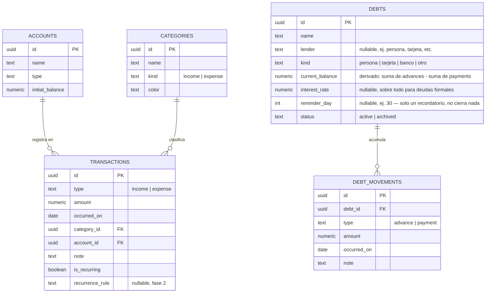

# Finanzas Personales — Documento de Diseño (v1)

**Fecha:** 2026-08-20
**Estado:** Borrador para socializar y validar alcance
**Propietario:** Juan
**Uso previsto:** Dejar este archivo en la raíz del proyecto para que Claude Code lo use como contexto de referencia durante el desarrollo.

---

## 1. Objetivo del producto

Aplicación web personal para tener un panorama completo de la economía propia: registrar ingresos y egresos, hacer seguimiento de deudas, y saber en cualquier momento cuánto queda disponible durante el mes — usable indistintamente desde el computador o desde el celular.

No es un producto para terceros ni multiusuario en esta primera versión — es una herramienta personal, pero diseñada con suficiente estructura como para poder extenderse sin rehacer el modelo de datos.

## 2. Supuestos y alcance de v1

- Un solo usuario (autenticación simple contra Supabase Auth, aunque solo la use Juan).
- Una sola moneda por ahora (configurable, pero sin conversión automática entre monedas en v1).
- Registro manual de movimientos (sin integración bancaria automática en v1).
- Datos en la nube (Postgres vía Supabase), accesibles desde cualquier dispositivo con navegador.
- **Patrón real de flujo de caja (clave para el diseño):** durante el mes casi nunca hay saldo a favor — solo los primeros días tras el pago — así que es normal pedir plata prestada a lo largo del mes y cancelarla el día 30. La app debe reflejar este ciclo, no asumir que el saldo se mantiene positivo.
- **Responsive desde el día uno:** la app se va a usar tanto desde el celular como desde el computador, indistintamente. No es "versión web primero, móvil después" — el diseño y la construcción tienen que funcionar bien en ambos tamaños desde el MVP.

Estos puntos son justamente los que vale la pena validar en la socialización — están marcados también en la sección 8 (Puntos a decidir).

## 3. Casos de uso principales

1. Registrar un ingreso o un egreso (monto, categoría, fecha, cuenta, nota).
2. Editar o eliminar un movimiento.
3. Registrarle un préstamo a una persona o entidad — y poder pedirle más en cualquier momento, incluso si ya le debes algo — además de registrar abonos parciales o totales. El saldo se acumula por acreedor, no se resetea cada mes.
4. Ver cuánto queda libre en el mes actual (ingresos − egresos − cuotas de deuda).
5. Ver el total de deuda pendiente y el detalle por deuda.
6. Filtrar/comparar gasto por categoría en un rango de fechas.
7. **Crear, editar y eliminar categorías propias** — no hay una lista fija de fábrica más allá de un set inicial sugerido (Vivienda, Comida, Transporte, Salario, Arriendo recibido, Ingresos ocasionales, Deudas/Cuotas, Otros — las dos de ingreso reflejan que Juan tiene sueldo fijo + arriendo de una casa, más trabajos ocasionales de construcción o mesero). El usuario debe poder agregar las que necesite en cualquier momento, tanto desde Configuración como al vuelo mientras registra un movimiento.
8. Configurar cuentas propias y moneda.
9. **Agregar un gasto en segundos**, desde cualquier pantalla — este es el caso de uso que más se repite en el día a día, así que la fricción tiene que ser mínima.
10. **Ver los movimientos más recientes de un vistazo** (ingresos, gastos y préstamos mezclados, del más nuevo al más viejo) — en verde lo que de verdad es ingreso, en rojo tanto los gastos como los préstamos que pides (porque un préstamo es una deuda, no un ingreso), y cuando es un préstamo, mostrar de quién es.

**Descartado del alcance:** ver la evolución del "patrimonio neto" (activos − deudas) como gráfica en el Dashboard. Se decidió que no aporta suficiente valor en el día a día frente a ver directamente la deuda total pendiente y los ingresos del mes (ver sección 8, punto 5).

## 4. Modelo de datos



Notas sobre el modelo:

- `transactions.amount` siempre positivo; el signo lo da `type`. Evita bugs de doble negativo en los cálculos.
- `is_recurring` y `recurrence_rule` se usan desde el MVP para los dos ingresos fijos de Juan (salario y arriendo de una casa) — se registran una vez y se repiten solas cada mes. Los ingresos variables (trabajos ocasionales de construcción o de mesero) NO son recurrentes: se siguen registrando a mano, uno por uno, cuando pasan.
- El patrimonio neto (suma de saldos de `accounts` − suma de `current_balance` de `debts`) se puede calcular con los datos que ya existen, sin tabla propia — pero se descartó mostrarlo en el Dashboard de v1 porque no aporta suficiente valor en el día a día (ver sección 8, punto 5). Queda disponible como cálculo simple si se necesita más adelante.
- **`DEBTS` cambió de "un préstamo por ciclo" a "una cuenta corriente por acreedor" (v2 del modelo):** contándome cómo le pides prestado a Andrés — varias veces en la misma semana, y a fin de mes a veces le cancelas todo y a veces queda un resto — quedó claro que un préstamo por persona no es un evento aislado, es un saldo que sube y baja. Por eso `DEBTS` ahora representa la relación con un acreedor (una fila por persona/tarjeta/banco, que normalmente no se "cierra"), y `DEBT_MOVEMENTS` reemplaza a `DEBT_PAYMENTS`: cada fila es o un `advance` (te prestan más → sube el saldo) o un `payment` (abonas → baja el saldo). `debts.current_balance` es la suma de esos movimientos — se recalcula o se cachea cada vez que se inserta uno. El saldo puede seguir positivo de un mes a otro sin ningún problema; no hay "cierre de ciclo".
- `debts.reminder_day` reemplaza a lo que antes era `is_monthly_cycle` + `due_date`: ya no representa el vencimiento de un préstamo específico (porque el préstamo ya no es un evento con final), sino un simple recordatorio de "sueles pagarle a esta persona cerca de este día". Es informativo, no bloquea ni cierra nada.
- Con este cambio, `debts.original_amount` y `monthly_payment` de la v1 del modelo ya no aplican igual: el "monto original" no tiene mucho sentido cuando hay múltiples préstamos acumulados, y la "cuota mensual" pasa a ser simplemente el próximo `payment` que registres. Si en el futuro se necesita una cuota fija obligatoria (por ejemplo para la tarjeta de crédito), se puede agregar como un campo aparte sin afectar el resto.

## 5. Arquitectura técnica propuesta

```
┌─────────────────────┐        ┌──────────────────────┐
│   Next.js (App)      │  HTTPS │   Supabase            │
│  - UI en React        │◄──────►│  - Postgres            │
│  - API routes / server │        │  - Auth                │
│    actions             │        │  - Row Level Security  │
│  - Tailwind CSS        │        └──────────────────────┘
│  - Recharts (gráficos) │
└─────────────────────┘
         ▲
         │
   Desplegado en Vercel (free tier)
```

- **Next.js**: un solo proyecto cubre frontend y backend (server actions o API routes), evita mantener dos repos.
- **Supabase**: Postgres gestionado + autenticación + Row Level Security (aunque seas el único usuario, RLS evita que la app quede abierta si algún día la expones).
- **Tailwind CSS**: estilos rápidos y consistentes sin escribir CSS desde cero, y es "mobile-first" por diseño — encaja bien con el requisito de responsive.
- **Recharts**: gráficos de barras/líneas para el dashboard (ingresos vs. egresos), usados con mesura — ver sección 6 sobre por qué el resumen del mes no es una gráfica de línea.
- **Responsive:** un mismo layout que se adapta con Tailwind — en escritorio, barra lateral fija con la navegación; en celular, la barra lateral se colapsa en una barra de navegación inferior (más natural para el pulgar) y las tarjetas pasan de estar en fila a apilarse verticalmente. No se construyen dos apps distintas, es el mismo código adaptado por breakpoint.

## 6. Pantallas (v1)

| Pantalla | Contenido principal |
|---|---|
| Dashboard | Balance disponible hoy, deuda total pendiente, ingresos del mes, lista de movimientos recientes (ingresos en verde; gastos y préstamos en rojo, estos últimos mostrando de quién), gráfico ingresos vs. egresos |
| Transacciones | Tabla filtrable + formulario de alta/edición, con opción de crear una categoría nueva sin salir del formulario |
| Deudas | Una tarjeta por acreedor con su saldo corriente (acumulado), historial de préstamos y abonos, y dos acciones: "Pedir más" y "Abonar" |
| Reportes | Gasto por categoría, comparación mes a mes |
| Configuración | Categorías (crear/editar/eliminar), cuentas, moneda |

**Captura rápida (elemento global, no una pantalla aparte):** un botón siempre visible ("+") que abre un formulario mínimo — monto y categoría, con fecha de hoy y cuenta más usada precargadas — para registrar un gasto en menos de 10 segundos desde cualquier pantalla. Todo lo demás (nota, cuenta distinta, etc.) queda opcional/colapsado. Este componente es tan importante como cualquier pantalla porque es lo que más se va a usar.

**Por qué el resumen de saldo ya no es una gráfica de línea:** la primera versión mostraba una curva de proyección día a día, pero era difícil de leer de un vistazo; una segunda versión (5 bloques por semana) tampoco terminó de convencer. La versión actual es una lista de "Movimientos recientes": los últimos ingresos, gastos y préstamos, del más nuevo al más viejo, verde si es ingreso real y rojo si es gasto o préstamo — con el nombre de la persona cuando es un préstamo (ej. "Préstamo — Andrés"). Es más concreto que una proyección: en vez de estimar el futuro, muestra lo que de verdad pasó, y dentro de `DEBT_MOVEMENTS` (sección 4) los `advance` son justamente los préstamos que aparecen aquí en rojo junto con el nombre del acreedor (`debts.name`).

**Responsive:** en escritorio la navegación es una barra lateral fija; en celular se convierte en una barra de navegación inferior con los mismos 5 destinos, las tarjetas se apilan en una sola columna, y el botón de captura rápida queda fijo arriba de esa barra inferior para que siga siendo alcanzable con el pulgar.

## 7. Roadmap por fases

### Fase 1 — MVP
CRUD de transacciones (con creación de categorías al vuelo), **ingresos recurrentes automáticos** para salario y arriendo, **captura rápida de gastos (componente global)**, CRUD de deudas (saldo acumulado por acreedor vía `DEBT_MOVEMENTS`, con "Pedir más" y "Abonar"), dashboard con totales del mes y "Movimientos recientes", **diseño responsive** (escritorio y celular), autenticación básica.

La captura rápida y "Movimientos recientes" no son extras: son el núcleo de por qué estás construyendo esto (saber en qué se te va la plata y cuándo tienes que pedir prestado, y poder registrar el gasto en el momento sin fricción). Van en el MVP, no en fases posteriores. Se agregó la recurrencia automática de ingresos porque, con sueldo + arriendo fijos, evita registrar manualmente lo mismo dos veces al mes.

### Fase 2 — Extensiones ya contempladas en el modelo
- Presupuestos por categoría con alertas al superarlos.
- Metas de ahorro (tabla nueva `savings_goals`).
- Exportar reportes a PDF/Excel.

### Fase 3 — Extensiones de mayor alcance (a validar si valen la pena)
- Multi-moneda con conversión automática (API de tasas de cambio).
- Importar extractos bancarios (CSV/OFX) para reducir registro manual.
- Multiusuario / compartir con familia (ya viable porque hay Auth + RLS desde v1).
- Integración vía Open Banking con bancos locales (alto esfuerzo, depende de disponibilidad en Colombia).
- Notificaciones (recordatorio de pago de deuda próxima a vencer).

## 8. Puntos a decidir en la socialización — ✅ MVP congelado

Todos los puntos abiertos ya se resolvieron (20 ago 2026). El alcance de la Fase 1 (sección 7) queda congelado con estas decisiones:

1. ~~¿Una sola moneda?~~ **Resuelto:** sí, solo COP. Multi-moneda se queda en Fase 3 si algún día hace falta.
2. ~~¿Las deudas incluyen préstamos informales?~~ **Resuelto (y afinado):** sí — y además a la misma persona le puedes pedir varias veces antes de saldar, así que `debts` pasó de "un préstamo por ciclo" a "una cuenta corriente por acreedor" con `DEBT_MOVEMENTS` (advances y payments) — ver sección 4.
3. ~~¿Recurrencia automática?~~ **Resuelto:** Juan tiene dos ingresos fijos (salario y arriendo de una casa) — esos dos se activan como recurrentes desde el MVP. Los ingresos variables (jornales de construcción, propinas de mesero) NO son recurrentes: se registran a mano cada vez, como cualquier otro movimiento.
4. ~~¿Presupuesto por categoría desde el día uno?~~ **Resuelto:** no por ahora. Con los totales del Dashboard y "Movimientos recientes" alcanza para empezar; presupuestos con alertas se queda en Fase 2 como estaba planeado.
5. ~~¿"Panorama general de mi economía" incluye activos no líquidos?~~ **Resuelto:** por ahora no — se quita el patrimonio neto del Dashboard y en su lugar se muestran deuda total pendiente e ingresos del mes, que son más accionables día a día (sección 3 y 6).
6. ~~¿Aviso/recordatorio antes del día 30?~~ **Resuelto:** no por ahora. Sin notificaciones en el MVP — con revisar el Dashboard basta.
7. ~~¿Cómo se implementan las categorías?~~ **Resuelto:** son completamente editables por el usuario — se arranca con un set inicial sugerido, pero se pueden crear, renombrar, recolorear y eliminar libremente, tanto desde Configuración como desde el propio formulario de registrar un movimiento (sección 3, caso 7).

## 9. Próximos pasos

1. ~~Revisar y ajustar este documento juntos.~~ ✅ Hecho.
2. ~~Congelar el alcance del MVP (Fase 1).~~ ✅ Hecho (sección 8).
3. Crear el proyecto Next.js + Supabase y aplicar el esquema de la sección 4 como migración inicial.
4. Construir en orden: esquema en Supabase → CRUD de transacciones → CRUD de deudas → Dashboard → Reportes.
5. Usar este archivo como `CLAUDE.md`/`DESIGN.md` en la raíz del repo para que cada sesión de Claude Code arranque con el contexto completo.

https://claude.ai/code/artifact/c71a8aa0-7895-45db-9119-50aa56743dc1
